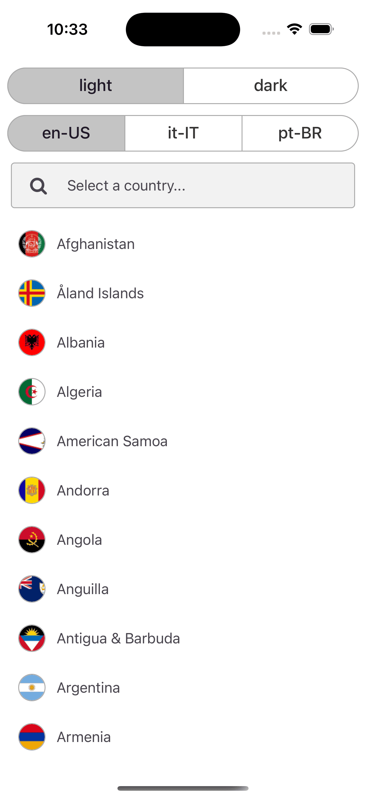
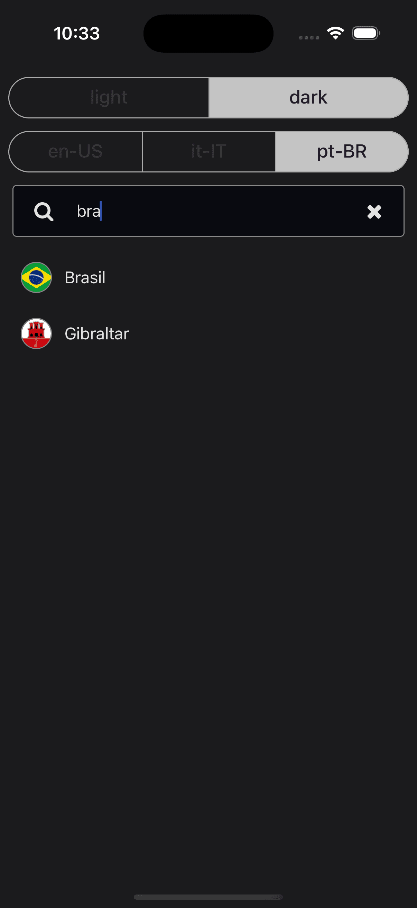

# Autocomplete Component

The Autocomplete component provides an easy-to-use and customizable autocomplete functionality for your React Native applications. It allows you to fetch suggestions dynamically as the user types, render custom items, and handle item selection.

## Features

- **Dynamic Data Fetching:** Fetch items based on a search filter.
- **Customizable Rendering:** Render each item, the icons, and even the TextInput itself with your own UI.
- **Theming:** Supports light and dark modes.
- **Style Overrides:** Customize the autocomplete container, input container, input text, and list.
- **Debouncing:** Optional debounce to reduce the number of requests on rapid input.

## Usage

The component is generic, meaning it can handle any data type. You must provide a function to fetch the items and a render function to display each item.

> **Memoize `fetchItems`** (e.g. with `useCallback`), otherwise the initial load re-runs on every render.

```tsx
import { useCallback } from 'react';
import { View, Text, Image } from 'react-native';
import { Autocomplete, CloseIcon, SearchIcon } from '@jereztech/react-elements';

export default function App() {
  const fetchItems = useCallback((filter?: string) => filterCountries(filter), []);

  return (
    <Autocomplete<Country>
      fetchItems={fetchItems}
      leftIcon={<SearchIcon style={styles.inputIcon} />}
      rightIcon={<CloseIcon style={styles.inputIcon} />}
      renderItem={({ item: country }) => (
        <View style={styles.listItem}>
          <Image source={{ uri: country.flagUri }} style={styles.flagRounded} />
          <Text style={styles.text}>
            {`(+${country.callingCode}) ${country.name}`}
          </Text>
        </View>
      )}
      onSelected={({ item }) => onSelected({ item })}
      onChangeText={filter => setState({ filter })}
    />
  );
}
```

## Props

Any other [`TextInputProps`](https://reactnative.dev/docs/textinput) are forwarded to the TextInput.

| Field                  | Type                           | Default                  | Description                                                         |
|------------------------|--------------------------------|--------------------------|---------------------------------------------------------------------|
| `theme`                | `ColorSchemeName`              | `'light'`                | The user's preferred color scheme (e.g. Dark Mode).                 |
| `placeholder`          | `string`                       | `'Type to search...'`    | Placeholder text for the TextInput.                                 |
| `placeholderTextColor` | `ColorValue`                   | `colors.onSurfaceVariant` | Overrides the placeholder text color.                              |
| `autocompleteStyle`    | `StyleProp<ViewStyle>`         | _None_                   | Overrides the Autocomplete container style.                         |
| `inputContainerStyle`  | `StyleProp<ViewStyle>`         | _None_                   | Overrides the input row container style.                            |
| `inputStyle`           | `StyleProp<TextStyle>`         | _None_                   | Overrides the TextInput text style.                                 |
| `leftIcon`             | `ReactElement \| null`         | `null`                   | Element rendered on the left side of the input.                     |
| `rightIcon`            | `ReactElement \| null`         | `null`                   | Element rendered on the right side of the input when there is text. Pressing it clears the filter. |
| `listProps`            | `Partial<FlatListProps<T>>`    | _None_                   | Overrides the default FlatList props.                               |
| `listStyle`            | `StyleProp<ViewStyle>`         | _None_                   | Overrides the FlatList style.                                       |
| `renderInput`          | `(props: TextInputProps) => ReactElement` | _None_        | Renders your own TextInput instead of the default one.              |
| `fetchItems`  | `(filter?: string) => Promise<T[]>`      | _None_  | Function to fetch items based on the provided search filter.                          |
| `renderItem`  | `(item: AutocompleteItem<T>) => ReactElement` | _None_  | Render function for each suggestion item.                                       |
| `debounceTime`| `number`                                 | `300`   | Optional debounce time (in milliseconds) for user input, controlling fetch frequency. |
| `onSelected`  | `(item: AutocompleteItem<T>) => void`    | _None_  | Callback function triggered when a user selects an item.                              |

## Demo

<div style="display: flex; justify-content: space-between; align-items: center;">
  
  
</div>

## License

This project is licensed under the **GNU General Public License v3.0** - see the [LICENSE](../../../LICENSE) file for details.

Copyright (C) 2025 [Jerez Tech](https://jereztech.com)