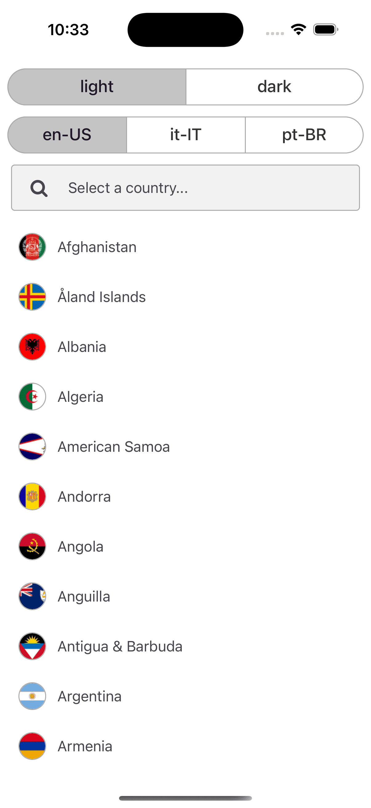
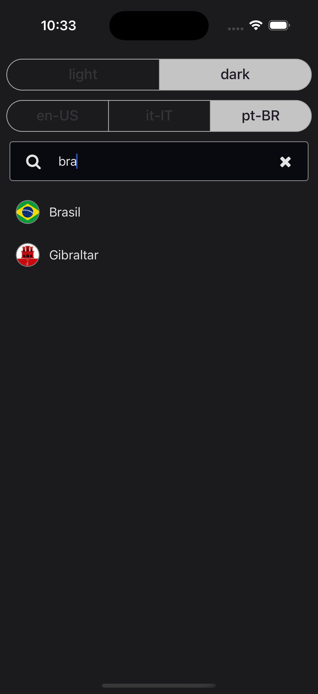

# Autocomplete Component

The Autocomplete component provides an easy-to-use and customizable autocomplete functionality for your React Native applications. It allows you to fetch suggestions dynamically as the user types, render custom items, and handle item selection.

## Table of Contents

- [Features](#features)
- [Installation](#installation)
- [Usage](#usage)
- [Props](#props)
- [Demo](#demo)
- [License](#license)

## Features

- **Dynamic Data Fetching:** Fetch items based on a search filter.
- **Customizable Rendering:** Render each item with your own UI.
- **Theming:** Supports light and dark modes.
- **Style Overrides:** Customize the autocomplete container, input container, list, and icons.
- **Debouncing:** Optional debounce to reduce the number of requests on rapid input.

## Installation

```bash
npm install @jereztech/react-elements
# or
yarn add @jereztech/react-elements
```

## Usage

The component is generic, meaning it can handle any data type. You must provide a function to fetch the items and a render function to display each item.

```tsx
import React from 'react';
import { View, Text, Image } from 'react-native';
import Autocomplete from '@jereztech/react-elements';

export default function App() {
  return (
    <Autocomplete<Country>
      fetchItems={filter => filterCountries(filter)}
      renderItem={({ item: country }) => (
        <View style={[styles.listItem]}>
          <Image source={{ uri: country.flagUri }} style={styles.flagRounded} />
          <Text style={styles.text}>
            {`(+${country.callingCode}) ${country.name}`}
          </Text>
        </View>
      )}
      onSelected={({ item }) => onSelected({ item })}
    />
  );
}
```

## Props

| Field                  | Type                           | Default                  | Description                                                         |
|------------------------|--------------------------------|--------------------------|---------------------------------------------------------------------|
| `theme`                | `ColorSchemeName`              | `'light'`                | The user's preferred color scheme (e.g. Dark Mode).                 |
| `placeholder`          | `string`                       | `'Type to search...'`    | Placeholder text for the TextInput.                                 |
| `autocompleteStyle`    | `StyleProp<ViewStyle>`         | _None_                   | Overrides the Autocomplete container style.                         |
| `inputContainerStyle`  | `StyleProp<ViewStyle>`         | _None_                   | Overrides the TextInput container style.                            |
| `inputProps`           | `Partial<TextInputProps>`      | _None_                   | Overrides the default TextInput props.                              |
| `listProps`            | `Partial<FlatListProps<T>>`    | _None_                   | Overrides the default FlatList props.                               |
| `iconProps`            | `Partial<IconProps>`           | _None_                   | Overrides the default Icon props.                                   |
| `fetchItems`  | `Function => Promise<T[]>`                               | _None_  | Function to fetch items based on the provided search filter.                          |
| `renderItem`  | `Function => ReactElement`               | _None_  | Render function for each suggestion item.                                             |
| `debounceTime`| `number`                                                          | `300`   | Optional debounce time (in milliseconds) for user input, controlling fetch frequency. |
| `onSelected`  | `Function => void`                     | _None_  | Callback function triggered when a user selects an item.                              |

## Demo

<div style="display: flex; justify-content: space-between; align-items: center;">
  
  
</div>

## License

This project is licensed under the **GNU General Public License v3.0** - see the [LICENSE](../../../LICENSE) file for details.

Copyright (C) 2025 [Jerez Tech](https://jereztech.com)