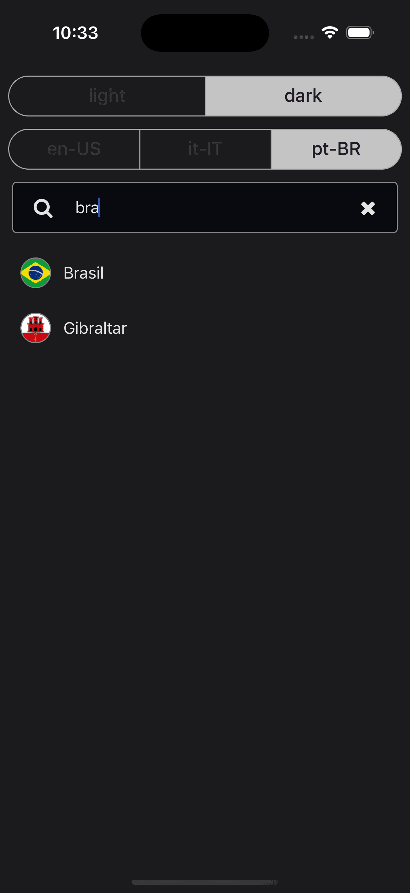

# CountrySelector Component

The `CountrySelector` component is a specialized autocomplete component for selecting countries. It leverages the generic autocomplete functionality to display country names, flags, and calling codes in a customizable list.

## Overview

The component extends the `AutocompleteComponentProps<Country>` interface, adding country-specific properties. It allows you to:

- Filter the displayed countries by ISO 3166 country codes.
- Support locale-based country translations.
- Customize the display of country flags (including a rounded option).
- Choose between different display variants (e.g., countries or calling codes).

## Usage Example

Below is an example of how to use the `CountrySelector` component:

```tsx
import React from 'react';
import { CountrySelector } from '@jereztech/react-elements';

export default function App() {
  return (
    <CountrySelector
      locale={locale}
      flagRounded
      placeholder={placeholder}
      onSelected={console.log}
    />
  );
}
```

## Props

The following table describes the props for `CountrySelector`.

| Field               | Type                                                   | Default                   | Description                                                                                       |
|---------------------|--------------------------------------------------------|---------------------------|---------------------------------------------------------------------------------------------------|
| `countryCodes`      | `string[]`                                             | _None_                    | When provided, only the countries with these ISO 3166 codes are shown.                            |
| `locale`            | `string`                                               | `'en-US'`                    | Locale for country translations.                                                                  |
| `variant`           | `'countries'` \| `'callingCodes'`                        | `'countries'`                    | The variant of the CountrySelector. Determines whether countries or calling codes are displayed.  |
| `onSelected`        | `(country: Country) => void`                           | _None_                    | Callback when a country is selected. Receives the selected `Country` as a parameter.              |
| `flagStyle`         | `StyleProp<ImageStyle>`                                | _None_                    | Overrides the style for the country flag image.                                                 |
| `flagRounded`       | `boolean`                                              | `false`                    | If true, the flag will be displayed with a circular shape.                                        |
| `listItemStyle`     | `StyleProp<ViewStyle>`                                 | _None_                    | Overrides the container style for each list item.                                               |
| `countryStyle`      | `StyleProp<TextStyle>`                                 | _None_                    | Overrides the text style for displaying the country name.                                       |

## AutocompleteComponentProps (Inherited)

| Field                  | Type                           | Default                  | Description                                                         |
|------------------------|--------------------------------|--------------------------|---------------------------------------------------------------------|
| `theme`                | `ColorSchemeName`              | `'light'`                | The user's preferred color scheme (e.g. Dark Mode).                 |
| `placeholder`          | `string`                       | `'Type to search...'`    | Placeholder text for the TextInput.                                 |
| `autocompleteStyle`    | `StyleProp<ViewStyle>`         | _None_                   | Overrides the Autocomplete container style.                         |
| `inputContainerStyle`  | `StyleProp<ViewStyle>`         | _None_                   | Overrides the TextInput container style.                            |
| `inputProps`           | `Partial<TextInputProps>`      | _None_                   | Overrides the default TextInput props.                              |
| `listProps`            | `Partial<FlatListProps<T>>`    | _None_                   | Overrides the default FlatList props.                               |
| `iconProps`            | `Partial<IconProps>`           | _None_                   | Overrides the default Icon props.                                   |

## Demo

<div style="display: flex; justify-content: space-between; align-items: center;">
  
  
</div>

## License

This project is licensed under the **GNU General Public License v3.0** - see the [LICENSE](../../../LICENSE) file for details.

Copyright (C) 2025 [Jerez Tech](https://jereztech.com)