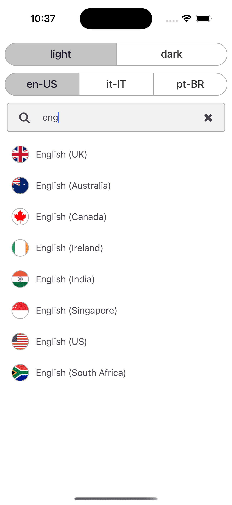
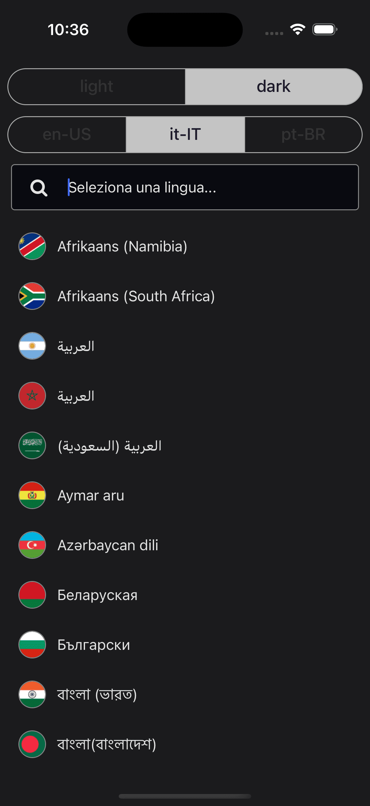

# LanguageSwitcher Component

The `LanguageSwitcher` component is a customizable autocomplete component for selecting languages. It supports two variants—`native` and `localized`—allowing you to display languages either by their native names or by localized names. This component is ideal for applications that need to switch between different languages while displaying flags and language names.

## Overview

`LanguageSwitcher` extends the `AutocompleteComponentProps<Language>` interface and adds language-specific properties. It provides:

- Support for filtering languages by supported locales.
- Options to display language names in their native or localized form.
- Customizable flag display with rounded options.
- Styling overrides for list items and language text.

## Usage Example

Below is an example of how to integrate the `LanguageSwitcher` component into your application:

```tsx
import React from 'react';
import LanguageSwitcher from '@jereztech/react-elements';

export default function App() {
  return (
    <LanguageSwitcher
      locale={locale}
      flagRounded
      placeholder={placeholder}
      onSelected={console.log}
    />
  );
}
```

## Props

The following table outlines the props for `LanguageSwitcher` and explains each property's type, default value, and description.

### LanguageSwitcherProps

| Field               | Type                                | Default                      | Description                                                                                          |
|---------------------|-------------------------------------|------------------------------|------------------------------------------------------------------------------------------------------|
| `supportedLocales`  | `string[]`                          | _None_                       | The supported locales. Only languages matching these locales will be displayed.                     |
| `locale`            | `string`                            | `'en-US'`                    | Locale for country translations and for displaying language names.                                   |
| `variant`           | `'native'` \| `'localized'`           | `'native'`                   | The LanguageSwitcher variant determines whether to display native or localized language names.       |
| `onSelected`        | `(language: Language) => void`      | _None_                       | Callback function triggered when a language is selected. Receives the selected `Language` object.    |
| `flagStyle`         | `StyleProp<ImageStyle>`             | _None_                       | Overrides the style for the flag image.                                                              |
| `flagRounded`       | `boolean`                           | `false`                       | If true, the flag will be displayed with a circular shape.                                           |
| `listItemStyle`     | `StyleProp<ViewStyle>`              | _None_                       | Overrides the container style for each list item.                                                  |
| `languageStyle`     | `StyleProp<TextStyle>`              | _None_                       | Overrides the text style for displaying the language name.                                         |

### AutocompleteComponentProps (Inherited)

| Field                  | Type                           | Default                  | Description                                                         |
|------------------------|--------------------------------|--------------------------|---------------------------------------------------------------------|
| `theme`                | `ColorSchemeName`              | `'light'`                | The user's preferred color scheme (e.g. Dark Mode).                 |
| `placeholder`          | `string`                       | `'Select a language...'` | Placeholder text for the TextInput.                                 |
| `autocompleteStyle`    | `StyleProp<ViewStyle>`         | _None_                   | Overrides the Autocomplete container style.                         |
| `inputContainerStyle`  | `StyleProp<ViewStyle>`         | _None_                   | Overrides the TextInput container style.                            |
| `inputProps`           | `Partial<TextInputProps>`      | _None_                   | Overrides the default TextInput props.                              |
| `listProps`            | `Partial<FlatListProps<T>>`    | _None_                   | Overrides the default FlatList props.                               |
| `iconProps`            | `Partial<IconProps>`           | _None_                   | Overrides the default Icon props.                                   |

## Demo

<div style="display: flex; justify-content: space-between; align-items: center;">
  
  
</div>

## License

This project is licensed under the **GNU General Public License v3.0** - see the [LICENSE](../../../LICENSE) file for details.

Copyright (C) 2025 [Jerez Tech](https://jereztech.com)