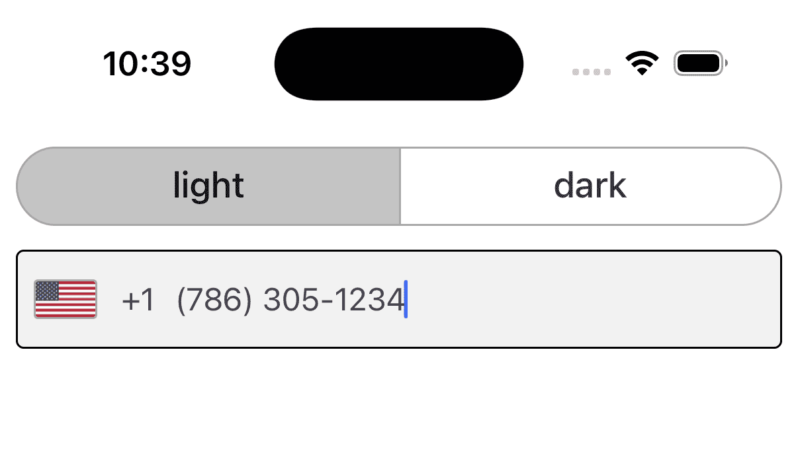
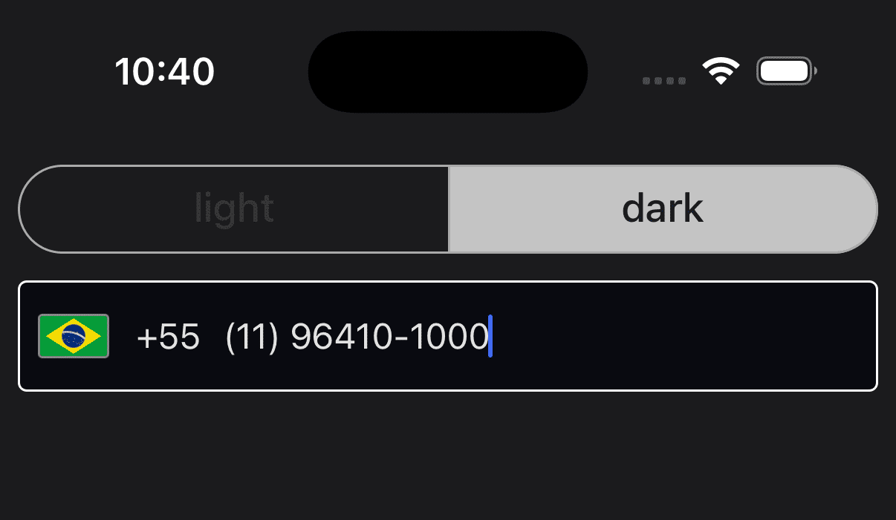

# PhoneInput Component

The `PhoneInput` component provides a user-friendly interface for entering and validating phone numbers. It leverages Google's libphonenumber library to format and validate phone numbers according to the international (ISO) standard. This ensures that the phone numbers entered are correctly formatted and valid.

## Overview

The `PhoneInput` component allows you to:
- Specify a fallback country code.
- Set a locale for country translations.
- Customize the appearance of the input field and flag icons.
- Validate and format phone numbers automatically on blur (when the input loses focus).

## Usage Example

Below is an example of how to integrate the `PhoneInput` component into your application:

```tsx
import { PhoneInput } from '@jereztech/react-elements';

export default function App() {
  return (
    <PhoneInput
        locale={locale}
        flagRounded
        onValidate={phoneNumber => setState({ phoneNumber })}
        onChangeText={phoneNumber => setState({ phoneNumber })}
        CountrySelectorWrapper={({ children, onDismiss }) => (
            <View style={{ flex: 1 }}>
                <Header
                    heading='select-country'
                    trailingIcon='close'
                    trailingIconAction={onDismiss}
                />
                {children}
            </View>
        )}
    />
  );
}
```

## Props

The following table outlines the props available for the `PhoneInput` component:

| Field                 | Type                                  | Default | Description                                                                                                                  |
|-----------------------|---------------------------------------|---------|------------------------------------------------------------------------------------------------------------------------------|
| `theme`               | `ColorSchemeName`                     | `'light'`  | The user's preferred color scheme (e.g. Dark Mode).                                                                         |
| `defaultCountry`      | `CountryCode`                         | `'US'`  | The fallback CountryCode used when no country is selected.                                                                  |
| `locale`              | `string`                              | `'en-US'`  | Locale for country translations.                                                                                           |
| `placeholder`         | `string`                              | `'Phone Number'`  | Placeholder text for the TextInput.                                                                                        |
| `editable`            | `boolean`                             | `'true'`  | If false, disables the TextInput.                                                                                          |
| `iconProps`           | `Partial<IconProps>`                  | _None_  | Optional props to customize the Icon.                                                                                      |
| `flagRounded`         | `boolean`                             | `'false'`  | If true, displays the country flags in a circular shape.                                                                   |
| `flagStyle`           | `StyleProp<ImageStyle>`               | _None_  | Overrides the default style for the flag image.                                                                            |
| `onValidate`              | `Function => E164Number` | _None_  | Validates and returns the phone number in international format when loses focus. |
| `inputContainerStyle` | `StyleProp<ViewStyle>`                | _None_  | Overrides the container style for the TextInput.                                                                           |
| `CountrySelectorWrapper` | `ComponentType<CountrySelectorWrapperProps>`                | `SafeAreaView`  | An optional wrapper component to render inside the Modal for the CountrySelector.                                                                           |

## Demo

<div style="display: flex; justify-content: space-between; align-items: center;">
  
  
</div>

## License

This project is licensed under the **GNU General Public License v3.0** - see the [LICENSE](../../../LICENSE) file for details.

Copyright (C) 2025 [Jerez Tech](https://jereztech.com)