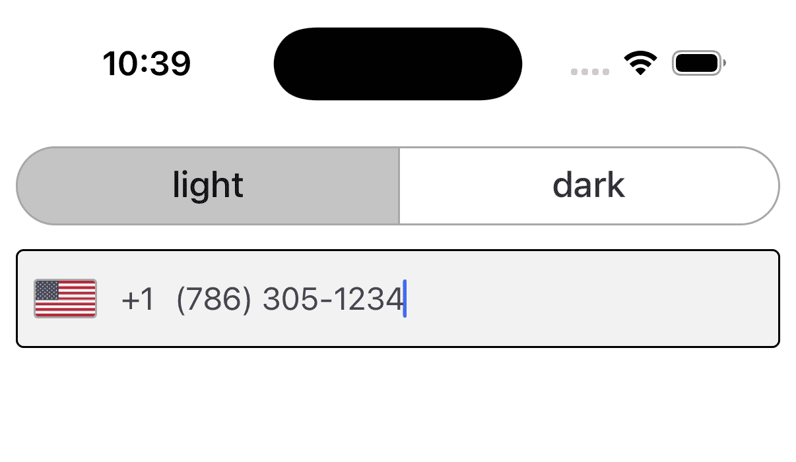
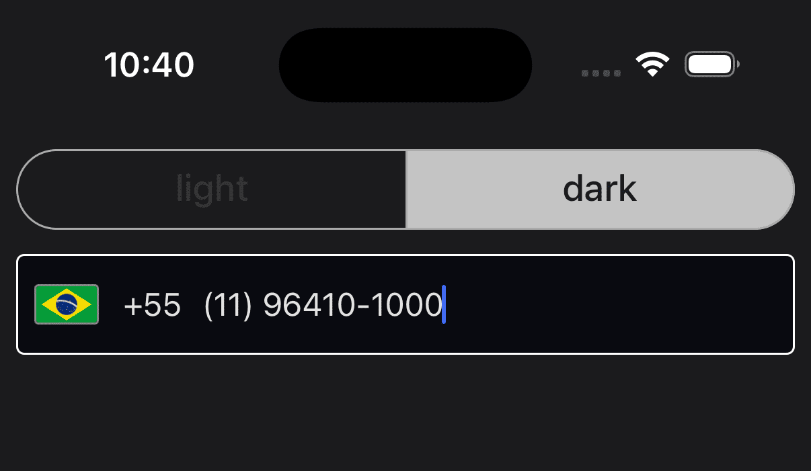

# PhoneInput Component

The `PhoneInput` component provides a user-friendly interface for entering and validating phone numbers. It leverages Google's libphonenumber library to format and validate phone numbers according to the international (ISO) standard. This ensures that the phone numbers entered are correctly formatted and valid.

## Overview

The `PhoneInput` component allows you to:
- Preselect a country code.
- Set a locale for country translations.
- Customize the appearance of the input field and flag icons.
- Formats the phone number as the user types.
- Validate phone numbers automatically on blur (when the input loses focus).

## Usage Example

Below is an example of how to integrate the `PhoneInput` component into your application:

```tsx
import { PhoneInput } from '@jereztech/react-elements';

export default function App() {
  return (
    <PhoneInput
        locale='en-US'
        defaultCountry='US'
        flagRounded
        value={state.phoneNumber}
        onChangeText={phoneNumber => setState({ phoneNumber })} // formatted plain text
        onChangeValue={phoneNumberObj => setState({ phoneNumberObj })} // Google's Phone Number
        CountrySelectorWrapper={({ children, onDismiss }) => (
            <View style={{ flex: 1 }}>
                <Header
                    heading='select-country'
                    trailingIcon='close'
                    trailingIconAction={onDismiss}
                />
                {children}
            </View>
        )}
    />
  );
}
```

## Props

The following table outlines the props available for the `PhoneInput` component:

| Field                 | Type                                  | Default | Description                                                                                                                  |
|-----------------------|---------------------------------------|---------|------------------------------------------------------------------------------------------------------------------------------|
| `theme`               | `ColorSchemeName`                     | `'light'`  | The user's preferred color scheme (e.g. Dark Mode).                                                                         |
| `defaultCountry`      | `CountryCode`                         | _None_  | The CountryCode preselected on mount, until the user picks another one. When omitted, no country is preselected.             |
| `locale`              | `string`                              | `'en-US'`  | Locale for country translations.                                                                                           |
| `placeholder`         | `string`                              | `'Phone Number'`  | Placeholder text for the TextInput.                                                                                        |
| `editable`            | `boolean`                             | `true`  | If false, disables the TextInput. The input is also disabled until a country is selected.                                     |
| `flagRounded`         | `boolean`                             | `false`  | If true, displays the country flags in a circular shape.                                                                   |
| `flagStyle`           | `StyleProp<ImageStyle>`               | _None_  | Overrides the default style for the flag image.                                                                            |
| `inputContainerStyle` | `StyleProp<ViewStyle>`                | _None_  | Overrides the container style for the TextInput.                                                                           |
| `modalStyle`          | `StyleProp<ViewStyle>`                | _None_  | Overrides the CountrySelector Modal container style.                                                                       |
| `CountrySelectorWrapper` | `ComponentType<CountrySelectorWrapperProps>`                | `SafeAreaView`  | An optional wrapper component to render inside the Modal for the CountrySelector.                                                                           |
| `countryPlaceholder` | `string`                | `'Select a country...'`  | Custom placeholder for the CountrySelector.                                                                           |
| `value`               | `string`                              | `''`    | Controlled phone number. When it parses as a possible number, the country and formatting are derived from it.                |
| `onChangeText`        | `(value: string) => void`             | _None_  | Called with the formatted display value on every change.                                                                    |
| `onChangeValue`       | `(phoneNumber?: PhoneNumber) => void` | _None_  | Called with libphonenumber's `PhoneNumber` on every change, or `undefined` when cleared.                                     |
| `renderInput`         | `(props: RenderPhoneInputProps) => ReactNode` | _None_ | Replaces the default input row with your own UI. Receives the state and handlers listed below.                          |

### RenderPhoneInputProps

Passed to `renderInput`: `value`, `placeholder`, `editable`, `maxLength`, `country`, `isValid`, `isFocused`, `onChangeText`, `onBlur`, `onFlagPress` (opens the country selector) and `onClear`.

## Demo

<div style="display: flex; justify-content: space-between; align-items: center;">
  
  
</div>

## License

This project is licensed under the **GNU General Public License v3.0** - see the [LICENSE](../../../LICENSE) file for details.

Copyright (C) 2025 [Jerez Tech](https://jereztech.com)